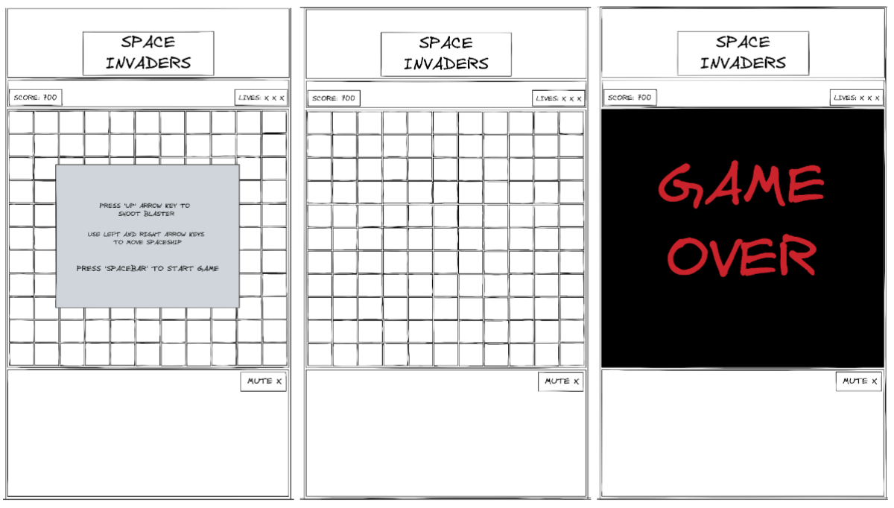

# GA SEI Project 1 - Space Invaders Game

## Overview

This project was completed as an assignment for the General Assembly Software Engineering Immersive course. The project is my own take on the retro arcade game Space Invaders, encompassing all of the original game features and styled in the classic black and green colours with a pixelated font and game characters. The objective of the game is for the player to defend against the attacking alien space invaders by shooting them before they reach the bottom of the game screen. Players must also attempt to evade the bombs dropped by the alien invaders by moving their spaceship horizontally. The game results in gameover if the player runs out of lives or the invaders reach the bottom of the game screen. Alternatively, the player wins if all the invaders are eliminated. The character movement in the game is made possible by using an 11 x 11 grid square in which css classes are consecutively added and removed from the relevant squares to represent movement.

**Tech used:** HTML, CSS, JavaScript, Git, GitHub, Excalidraw

**Timeframe:** 6 days | Solo

## Planning the Game

My first step towards building my space invaders game was to plan out exactly what I needed to produce the end result. This involved making a workflow chart for the project to map out the order by which work would be completed. After some planning I first created the wireframe of what I wanted the game user interface to look like. I used Excalidraw to complete the wireframe which was separated into the different game views: start game, in-play, and gameover.

After finishing the plan and wireframe, I created a new github repository for my project to enable version control and to backup my local project files which to begin with consisted of a folder with three blank files for HTML, CSS and JavaScript. After my development environment was set up, I started thinking about the game functionality and broke it down into separate game functions. Then I began to write the pseudocode for the game's internal javascript logic that was required to make each of the game functions work as they should, just like in the original arcade version of space invaders. I wrote the pseudocode straight into the app.js file in the game folder so that I would have a guide/instructions to follow when composing the code for individual functions.
