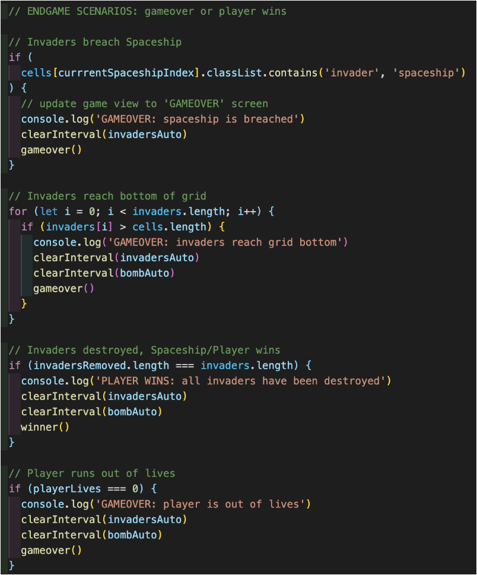

# GA SEI Project 1 - Space Invaders Game

## Overview

This project was completed as an assignment for the General Assembly Software Engineering Immersive course. The project is my own take on the retro arcade game Space Invaders, encompassing all of the original game features and styled in the classic black and green colours with a pixelated font and game characters. The objective of the game is for the player to defend against the attacking alien space invaders by shooting them before they reach the bottom of the game screen. Players must also attempt to evade the bombs dropped by the alien invaders by moving their spaceship horizontally. The game results in gameover if the player runs out of lives or the invaders reach the bottom of the game screen. Alternatively, the player wins if all the invaders are eliminated. The character movement in the game is made possible by using an 11 x 11 grid square in which css classes are consecutively added and removed from the relevant squares to represent movement.

**Tech used:** HTML, CSS, JavaScript, Git, GitHub, Excalidraw

**Timeframe:** 6 days | Solo

## Planning the Game

My first step towards building my space invaders game was to plan out exactly what I needed to produce the end result. This involved making a workflow chart for the project to map out the order by which work would be completed. After some planning I first created the wireframe of what I wanted the game user interface to look like. I used Excalidraw to complete the wireframe which was separated into the different game views: start game, in-play, and gameover.

After finishing the plan and wireframe, I created a new github repository for my project to enable version control and to backup my local project files which to begin with consisted of a folder with three blank files for HTML, CSS and JavaScript. After my development environment was set up, I started thinking about the game functionality and broke it down into separate game functions. Then I began to write the pseudocode for the game's internal javascript logic that was required to make each of the game functions work as they should, just like in the original arcade version of space invaders. I wrote the pseudocode straight into the app.js file in the game folder so that I would have a guide/instructions to follow when composing the code for individual functions.

Before I began writing any code, I wanted to decide on the general styling and UI for the game, for which I decided to go with a two-colour scheme of black and green with pixelated fonts, similar to the original retro/arcade space invaders game. Then, I decided on and downloaded all of the game assets that I would need for the game styling, which involved downloading fonts, and images and sounds for each of the game characters and their collisions they have with each other.

## Coding

After the planning, wireframe, game asset downloads were completed I began coding! My main objective at this point was to get the project to a working MVP that performed all of the game functions from the original space invaders game, then after that I could look to introduce additional features to the project.

I first started working on writing the HTML as this was not too difficult and quite straightforward due to the detailed wireframe that I created earlier which mapped out the page structure using a HTML tree. I also made sure to add descriptive class and id tags to the relevant elements that I would be later targeting with CSS or JavaScript.

Next, I started to work on the CSS file. As described in my project workflow, my objective in this step was to write only the basic CSS at this point which was enough to allow functionality of the game. I used CSS flexbox to structure the content on the page and used the wireframe as a guide for sizing and positioning of the HTML elements. This involved centering the main game grid in the centre of the page and making the page height and width fit to the screen. I then added in a pixel font which I downloaded from google fonts and applied to all text. After that I introduced colours into the game, making the background of all divs or elements as black and the borders of divs and buttons to be green, which gave the game the authentic styling combination seen in my arcade console games.

The next step was to begin writing the JavaScript in the App.js file created earlier that would manipulate the elements in the DOM. The pseudocode that I wrote earlier was a big help in writing the JavaScript for this section as each of the game functions already had instructions for what they should do. I first wrote the code for the createGrid() function which generated the 121 grid squares that made up the 11 x 11 game grid to support the movement of the game characters. The function created the grid squares by running a loop for the amount of grid squares required and created a div for each one by using the createElement() method on the document and appended the each square to the grid array and gave each div an index number as an attribute to allow the targeting of specific grid squares.

Next, I started on writing the functions that would both add and remove the character classes from each of the grid squares. I called these functions addInvaders() / removeInvaders() and addSpaceship() / removeSpaceship() as can be seen in the code below. I did this for the invader classes and also the spaceship class as this JavaScript logic would be frequently within the game. These functions worked by running a for loop if needed and removing or adding the specified character class from or to the specified grid cell using classList.add().

On the third day of working on my project, I began to work on the functions that move the game characters across the squares of the game grid. The first of which was the moveInvaders() function which was responsible for automatically moving the group position of the invaders in the game grid horizontally from one side of the grid to the other then moving down vertically by one square after colliding with the game edge. The movement worked by first removing the invader classes from the grid squares. Then, I used loops to change the index values for each invader and also manipulated the direction and rightPath variables which also controlled movement and direction of the invaders. After the values of these variables were changed I called the addInvaders() function to add the invader class back to the relevant grid squares. I then used the setInterval method to run the moveInvaders() function every 0.6 seconds and repeat until broken or stopped by a specified condition.

In a similar process, I created the moveSpaceship() function which is responsible for the horizontal movement of the spaceship character at the bottom row of the game grid. Though, the difference is that this function uses switch statements and listens for events from the user which entail pressing either the right or left arrow keys to move the character class accordingly.

The shoot() function enables the user to click the ‘UP’ arrow key to shoot a laser and destroy the alien invaders. It works similarly to previous functions by removing the laser, changing the laser index value, then adding the class the relevant grid squares to mimic the movement of the laser. The function uses a setInterval() to allow the laser to move to the top of the game grid and is then stopped if the top edge is reached. The function also includes an if statement which runs when a collision happens with either another cell that has the invader class or bomb class - this removes all character classes from the cell and adds an explosion class for 0.2 seconds and plays the explosion sound effect. Then finally adding the removed invader to the removed invaders array and changing the gamescore and updating the html scoreboard element. A similar process was using in the creation of the bomb function which mimics the x position of the users’ spaceship character on the grid while simultaneously taking in the y position of the invaders’ grid position. Knowing this grid position allows for the bomb to be dropped directly above the spaceship character every 0.4 seconds. The bomb() function uses the same javascript code for character movement and collision events as the shoot() function while also using similar character classes and sound effects.

Written within the moveInvaders() function are the endgame scenarios which are game scenarios that may result in the game ending. They are written as if statements that run some code if the given condition of the if statement has been met. I coded four endgame scenarios in the game which are: invaders breaching spaceship character cell, invaders reach bottom of the game grid, all invaders have been destroyed by the player shooting lasers, and player runs out of lives after being damaged from bombs dropped by invaders. In these scenarios once the condition have been met, the game intervals for invader movement and invader bombing are cleared to stop those function running. Then, a function such as gameover() or winner() is run to change the game state.

The next job to do was to introduce the different game views. We already have the inplay game view, but we also need a view for starting the game and when the game is over. The gameviews work by using html overlays that sit on top of the game grid and are made hidden or visible through calling one of the startGame(), gameover() and winner() functions. These functions are called from either a clicked button for startGame() or if the conditions for one of the endgame scenarios are reached which will run gameover() or winner() based on the scenario. These functions will manipulate the display attribute of the html overlay elements, change the game state variable, play a specified sound effect and remove any classes and clear game intervals.

One of the last tasks after the initial coding was completed and all functions were working it was time to refactor the code to improve structure and readability without changing any functionality. This also involved removing any repetition to make code DRY. Finally, the finished code was committed to github and then hosted using GitHub pages.

## Gameflow

The developed game has four separate game states which are active only when the page is loaded or specific game conditions have been reached. The first of which is the game start view that occurs when the page loads and includes an overlay with space invaders logo, game instructions and the start game button which runs the startGame() function when clicked. The next view that is experienced by the user is the in-game view which is the main view for the game and where all of the javascript dom manipulation is displayed - this is depicted below as the top-right image. Lastly we have the endgame views which display a similar overlay for when the player either wins or loses the game and will be shown the winner overlay or the gameover overlay respectively. Both of these endgame overlays include a play again or start button that calls a function to return the game state to the start.

## Project Wins

- This was my first project on the course and I’m really happy with what I produced having only spent a relatively short amount of time learning the actual logic that went into the JS code.
- I’m really pleased with the styling on this project with it being very similar to the original retro arcade game. This was achieved with relatively minimal effort and a short time by using css flexbox for positioning and downloading fonts and assets to match the original styling.

## Key Learnings

- This was the first project for which I’ve had an extensive plan which included a project workflow and detailed wireframe. This massively helped me in the coding process and allowed me to visualise the logic of each function and their interactions. The importance of project planning cannot be overstated and putting the work in throughout the planning stage definitely pays off down the line and contributes to a smoother coding experience.
- Writing the bulk of the project code in vanilla JavaScript is a great learning experience for understanding basic JS syntax but also when functions can get quite complex or long it gives justification for why developers commonly use frontend libraries like React.

## Challenges / Bugs

- One of the bugs that I had to fix while coding the project was that the laser class would get stuck in the left top corner of the grid screen when the user shot the laser and missed. The resolution for this was to change the condition of the if statement that cancelled the interval once the laser index value was lower than a given value.
- As I’ve played the game countless times now, I’ve found a bug that prevents the overlap of the sound effects for the game characters. This makes the sound effects sound unpleasant if the user spams the shoot key. This is currently unfixed but I would like to fix in the future.

## Future improvements

- Mute button - this feature would mute all game sounds when clicked by the user. This feature was in my initial project plans but after encountering some errors with the feature early in the development process I decided to remove it from the MVP and make it an additional goal to work on post-project.
- Highscores - this feature would take in a users name via a form input on the game start and it would store the user name and score to a highscores board using local storage.
- Increase Game Difficulty - this would be the most significant improvement to the game and would allow the user to go onto other game levels after destroying all invaders. New levels would include more invaders that are harder to destroy and move faster then previous levels. Additionally, the period by which bombs are dropped on the users’ spaceship can be reduced to further increase difficulty.
- Lastly, I think there is still some work to do in regard to refactoring code. The current codebase works and fulfils my initial aims for the project but I think it code be tidied up and written in a more elegant way.
